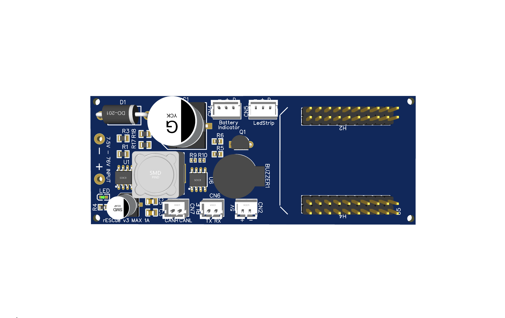
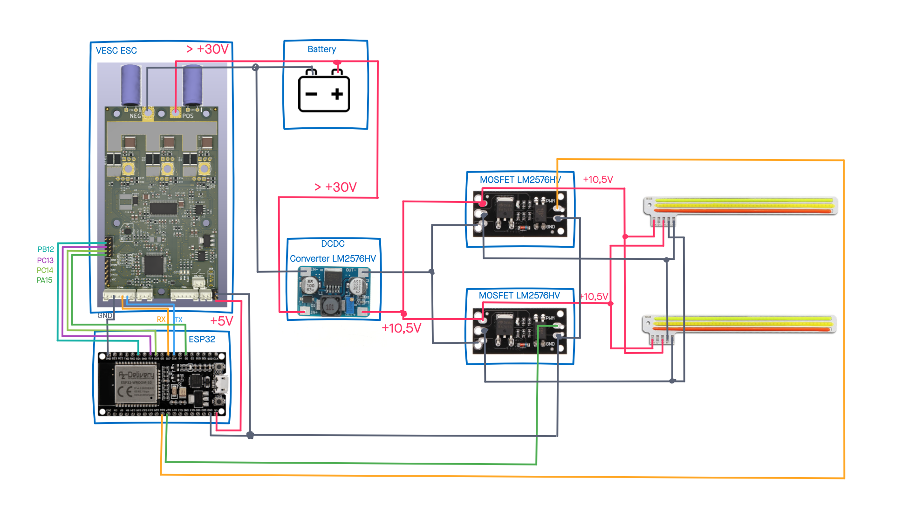
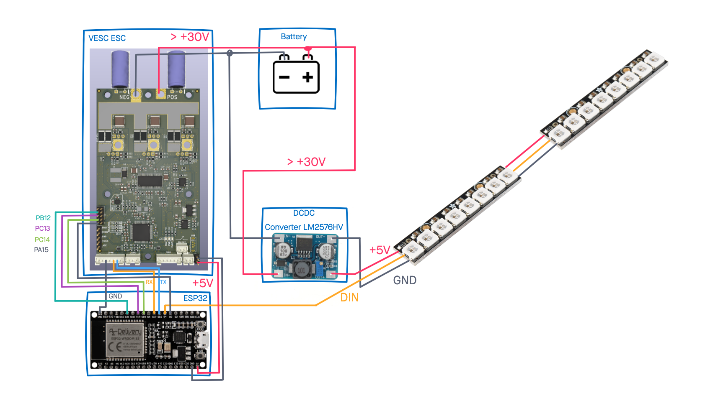
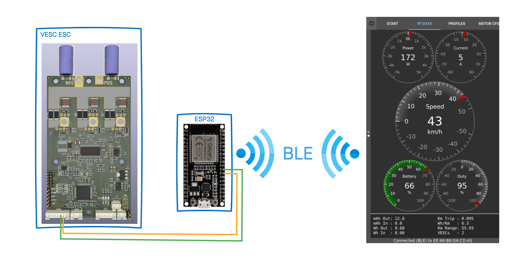
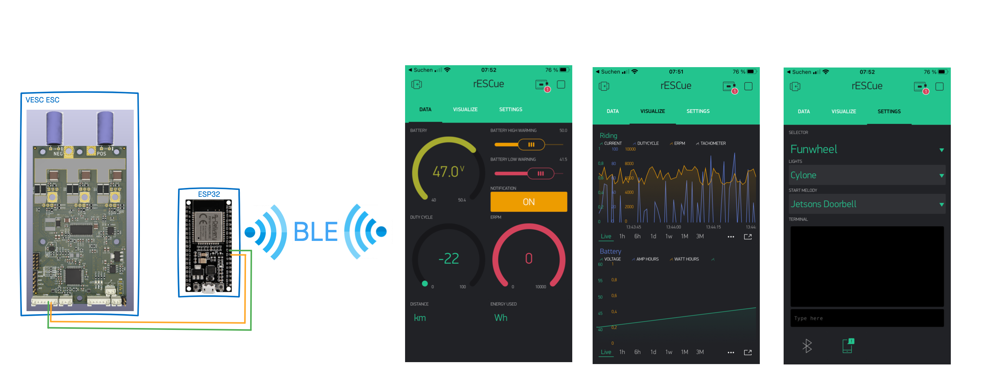

# rESCue - add more safety and control to your VESC based vehicle

*2021-04-09: Renamed from "funwheel-controller" to rESCue.*

This repository contains code to add some additional features to the [VESC](https://vesc-project.com)-based vehicles by enhancing it with a separate ESP32-controller to control front- and back-lights, monitor the battery and add Bluetooth VESC-UART-bridge. It was originally created for the [Funwheel](https://www.youtube.com/watch?v=K8beIoe0NuM)

The ESP32 D1 Mini is highly recommended, but other ESP32 also work.

## Hardware and wiring

### Wheelbarrow PCB

If you're interested in an almost plug-and-play solution, you might want to get the Wheelbarrow PCB. Jonas from the #Funwheel Discord-server did a great Job and designed a PCB.

Here's what rev3 of it looks like.



- sizing 95mm x 41mm
- input voltage 7,5V - 76V
- output 5V, 1A maximum
- ESP32 D1 mini header
- JST-PH header for CANBUS, UART, LED-Battery-indicator, LED-lights

More documentation to come as soon as the PCB officially available.

### Hardware

If your not interested in the Wheelbarrow PCB and want build it yourself or only want to use parts of this project, find the recommended hardware below. Other parts may also work, but the recommended parts are best tested.

- [ESP32 D1 Mini](https://www.amazon.de/AZDelivery-Bluetooth-Internet-Development-Compatible/dp/B08BTRQNB3/), other ESP32 might also work but check if all needed GPIO are accessible

- DC-DC converter ([LM2576HV](https://www.banggood.com/RIDEN-5V-60V-To-1_25V-30V-LM2576HV-DC-DC-Step-Down-Module-p-1060892.html?cur_warehouse=CN&rmmds=search))

- Piezo-Buzzer (any model should work)

For WS28xx Adafruit Neopixel are recommended

- 4x [Adafruit Neopixel stick](https://www.adafruit.com/product/1426) or compatible. Solder 2 sticks together for front and back each.

If you want to use COB modules, tri-color 12V COB with two MOSFET modules are recommended

- [Tri-Color COB module](https://de.aliexpress.com/item/4001104767020.html?spm=a2g0s.9042311.0.0.172a4c4dnC5uX4)
- [D4184 MOSFET module](https://www.banggood.com/3pcs-D4184-Isolated-MOSFET-MOS-Tube-FET-Relay-Module-40V-50A-p-1444317.html?rmmds=myorder)

### Wiring

Connect you VESC (e.g. [Cheap FOCer 2](https://github.com/shamansystems/Cheap-FOCer-2)) to the RX- and TX-PINs of the UART2 of your ESP32 (GPIO 16 & 17).

Connect your Cheap FOCer to GPIOs of the ESP32 as follows:

|ESP32 | Cheap FOCer 2|Description|
|:---:|:---:|:---:|
|GPIO 16 | RX| UART (if used)|
|GPIO 17 | TX| UART (if used)|
|GPIO 26 | CANBUS-RX | the GPIO is connected to the CAN-tranceiver, not directly to the CF2|
|GPIO 27 | CANBUS-TX | the GPIO is connected to the CAN-tranceiver, not directly to the CF2|
|GPIO 18 | PC13 | forward|
|GPIO 19 | PC14 | backward|
|GPIO 21 | PA15 | brake |
|GPIO 5 | PB12 | buzzer |

Connect your WS28xx pixel to the DC-DC converter and attach the DIN-Pin to GPIO 4 of your ESP.

Connect your Piezo buzzer with the negative lead to GPIO 25 and the positive lead to GND.

This table shows the PIN mapping:

|ESP32 | Component |Description|
|:---:|:---:|:---:|
|GPIO 4 | DIN lights|LED-Lights|
|GPIO 25 | DAC / I2S |Buzzer / Speaker|
|GPIO 22 | MOSFET1 |COB white front / red back (if COB is used)|
|GPIO 23 | MOSFET2 |COB red front / white back (if COB is used)|
|GPIO 34 | Voltage divider |Battery input (if voltage divider is used)|
|GPIO ?? | DIN battery |Battery indicator|


## Features

- Support for Front- and Backlight
- Battery monitor (visual and acoustic)
- transparent BLE-UART bridge for VESC-App
- CANBUS and VESC-Status
- Blynk-App (Monitoring & Configuration)

### Front- and backlight control

When powered the lights show a short startup sequence. While riding, the LEDs in drive direction are shining white and the LEDs facing against riding direction shine red.

When braking the lights at the back will flash red.

#### COB version

In this version, two 12V COB modules are controlled by MOSFETs. When using tri-color COB, switching the light color from white to red and vice versa based on the driving direction is supported.

The recommended COB (see above) are very bright, use up to 10W and  get very hot when operating at 12V. Therefore they should be operated at 10.5V only.



#### WS28xx (Neopixel) version

In this version WS28xx (aka Neopixel) LEDs are used for the front- and backlight. Dependening on the number of LEDs and the specs of the used ESP32 and WS28xx, it might also be possible to connect the WS28xx stripe directly to 3,3V of the ESP32. Nevertheless it's recommended to safely power the WS28xx stripe with a separate DC/DC converter.



Using any other number of LEDs then 16, the `NUMPIXELS` definition has to be changed in the config.h file.

### Battery monitor

The battery monitor uses either the CANBUS or a simple externale voltage divider which allows measuring the voltage from 0 - 100 V with the analog input of an ESP32.

The ESP12 uses 12bit (0-4095 )and 3.3V logic.


The battery level is monitored against the configured values, no matter if CANBUS or ean external voltage divider is used. If the battery level drops close the configured value, the piezo buzzer will give you a warning tone. If the battery level drops under the configured value, an alarm tone sounds.

If a WS28xx stripe is connected, the battery level will also been shown in 100/PIXEL_NUMBER steps, e.g. if a stipe with 5 pixel is connected, each pixel represents 20% of the capacity.
Every single pixel is further subdivided and changes color from green to red.

For further information on measuring voltages with the ESP32, check this [great video](https://www.youtube.com/watch?v=5srvxIm1mcQ).

### Transparent BLE-UART proxy for VESC app

The VESC applications for desktop and mobile are able to connect to the VESC via Bluetooth Low Energy (BLE). Normally you'll need a separate Bluetooth module (e.g. NRF51822) connected to your VESC. The ESP32 will do the same. Connected to the UART interface of the VESC, it allows to connect the App via BLE to the VESC.

The desktop and mobile version of the [VESC tool app](https://vesc-project.com/vesc_tool) (Linux, Windows, Android) and also [Yours Truly](https://apps.apple.com/gb/app/yours-truly/id1523671235) are well tested and should just work fine.



### CANBUS and VESC-Status (new)

___Attention___: this feature is only available using an ESP32 and a separate CAN-tranceiver, e.g. the SN65HVD230.

Connection to the VESC via CANBUS is now also supported. The connection to the CANBUS will bring you status updates of your VESC. These information include

- dutyCycle - the current duty cycle
- rpm - the RPM  from the VESC
- current - the current, the VESC uses
- ampHours - the ampere hours the VESC has used from the battery
- ampHoursCharged - the ampere hours the battery has been charged by the VESC
- wattHours - the watt hours the VESC has used from the battery
- wattHoursCharged - the watt hours the battery has been charged by the VESC
- mosfetTemp - the temperature of the MOSFETs
- motorTemp - the temperature of the Motor, if supported by the motor
- inputVoltage - the input voltage, which is the voltage of the battery
- tachometer - the current speed calculated by the VESC

Please check your CAN configuration in VESC. Make sure the VESC_ID matches the VESC_CAN_ID in `config.h` and doesn't collide with the ESP_CAN_ID.
This application assumes you have enabled status messages 1-5, please update your CAN-settings in VESC appropriate to have full support of all features. It is also recommended to reduce the frequency for status updates from the VESC. The default setting is 50Hz, but it is sufficient for this application to reduce the frequency to somehow around 1-5Hz.

If the CANBUS-feature is enabled, the battery monitor can also use the voltage measured by the VESC. A separate voltage divider isn't necessary in that case.

### Blynk-App (Monitoring & Configuration)

rESCue also supports the [Blynk-App](https://blynk.io/).


The Blynk-App is used to configure the ESP32, e.g. the lights and sounds and also the monitoring features including charts and local push-notifications (Android only, iOS doesn't work in Blynk at the moment).



If you'd like to use our Blynk dashboard, simply download the Blynk app to your smartphone and scan this QR code.

To use this App with the official Blynk server, you'll might need to buy some energy as this App needs more than the 2000 `free energy` points. Therefore we offer you to use the `thank-the-maker.org` server, which gives you more than enough energy to run this app.


## Configuration

All the configuration can be found in the `config.h` file and is mostly self explaining (I hope).

There are some parameters you should check, e.g. the settings for battery voltage and which type of front- and backlight you want to use. Just read the comments on each parameter.

## Build Firmware

This project is build on PlatformIO. To build the firmware for the ESP32 install the [core version](https://platformio.org/install/cli) of PlatformIO to your computer. An alternative way is to install the PlatformIO extension for your [favourite IDE](https://platformio.org/install/ide).

Clone this repository to your local computer and change into the created directory.

```shell
git clone https://github.com/thankthemaker/rESCue && cd rESCue
```

To build the firmware and upload it to you ESP32 MCU run

```shell
platformio run --target upload
```

## Donate

If you'd like to donate for my work

[ ](https://www.paypal.com/cgi-bin/webscr?cmd=_s-xclick&hosted_button_id=NDZFGUZC6RJCQ)

## Renaming from "funwheel-controller" to "rESCue"

Why did we rename the project?

Well, the project is no longer only related to the Funwheel, basically it's valuable for all VESC based vehicles and was already adopted by the Floatwheel community. The project started with the intention to only bring switchable LEDs to the Funwheel but evolved to complete solution to bring more features, fun and of course safety to you VESC based vehicle. Especially for self-balanced vehicles like the Funwheel or the Floatwheel this software might help to prevent damage to yourself and your vehicle by giving you visual and acoustic feedback.

Enjoy and stay / ride save!!!
